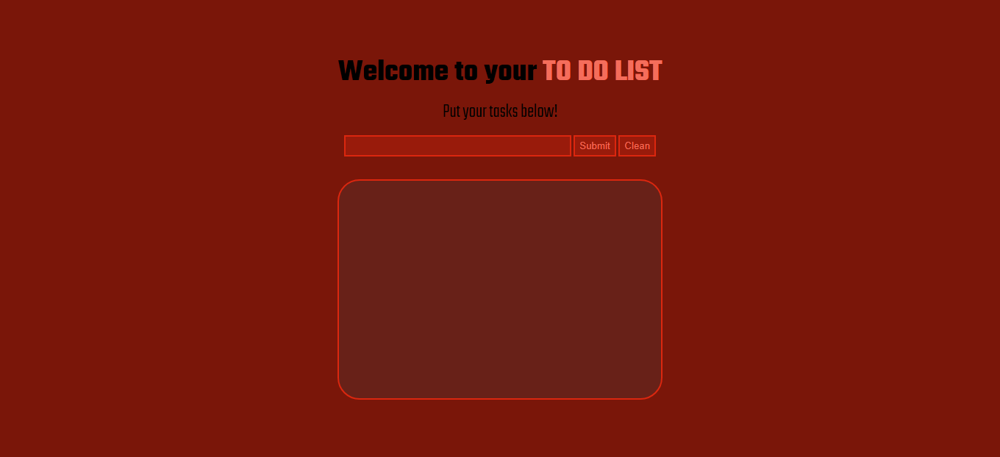

<h1 align="center">To do List</h1>

This is a to do list website, where you can list the tasks that you need to do!

Summary
===========
<!--ts-->
  * [About](#about)
  * [Screenshot](#screenshot)
  * [How to use](#how-to-use)
  * [Status](#status)
  * [Features](#features)
  * [Technologies](#technologies)
  * [Author](#author)
<!--te-->

About
-----
I made this simple and functional project with the objective to practice pure HTML, CSS and mainly JavaScript because it's the technology that I'm learning now. (I love the style of this project)

Screenshot
----------

How to use
----------

To run this to do list you will only need to open the HTML in a browser.

When the page is open, you can write your tasks in the input and submit to add them in the box below. You can also clean the box removing all tasks.

Every task added in the box have two buttons, one to mark the task as concluded and the other to remove that single task.

If you mark a task as concluded you can not remove it from the box anymore, only cleaning the whole box!

Status
------
Concluded :heavy_check_mark:

Features
--------
- [x] List tasks in order
- [x] Mark a task as concluded
- [ ] Add a empty task
- [x] Remove the task that you want or all of them
- [ ] Edit a submited task

Technologies
------------
- [HTML](https://html.com/)
- [CSS](https://www.w3.org/Style/CSS/Overview.en.html)
- [JavaScript](https://www.javascript.com/)

Author
------
<h3 align="center">Rafael Tavares</h3>
<a align="center" href="https://www.instagram.com/rafatavares03/">Instagram</a>
